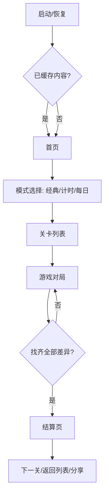
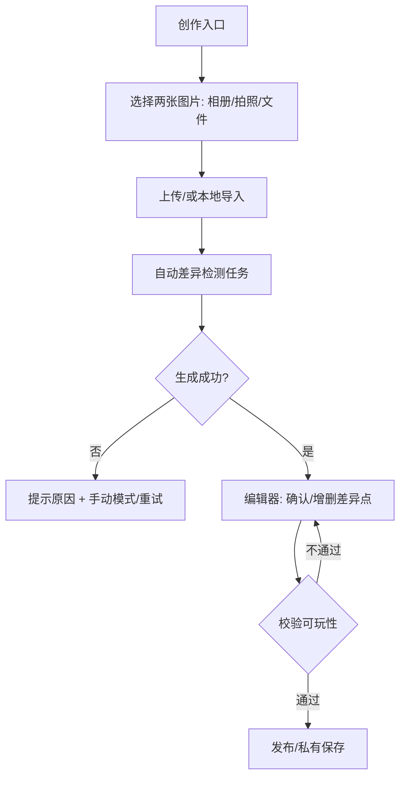
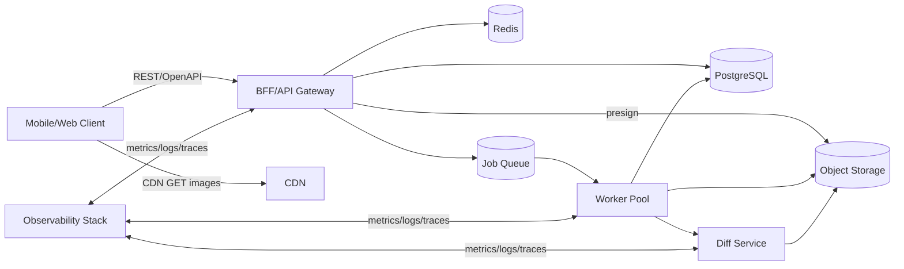
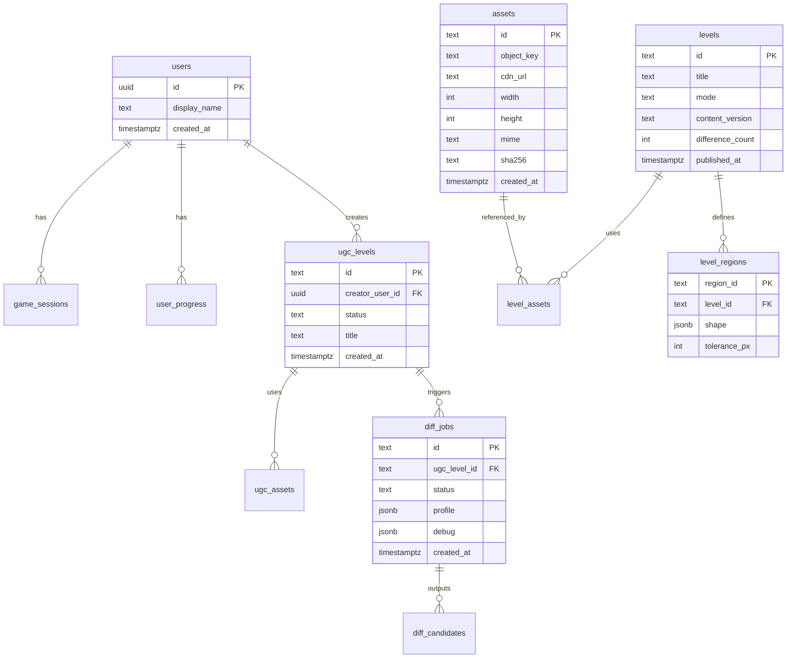
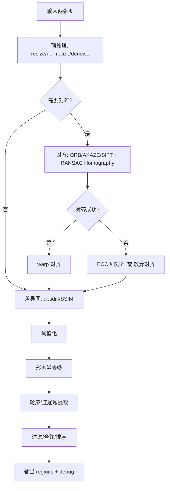

# 两张图片找不同游戏应用骨架分析与开发输入说明

## 执行摘要

本报告面向“两张图片找不同”游戏（内置关卡 + 用户上传自定义关卡），在“同时支持 iOS/Android/Web、用户量级中等”的默认假设下，给出可直接用于开发的应用骨架：功能需求优先级清单、跨端 UI/交互状态说明、前后端模块划分与数据模型、API 端点契约、差异检测算法方案对比与推荐组合、资源资产管线、测试/部署/监控、安全与隐私要点，以及以 MVP 为核心的交付里程碑。核心建议是采用“客户端本地命中判定 + 服务端异步差异生成/内容管线”的混合架构：内置关卡优先离线预计算并可人工校准；用户上传关卡通过图像对齐（特征匹配/ ECC）+ SSIM/像素差分生成候选差异区域，再由用户在“制作器”中确认/编辑，以提升鲁棒性与可控性。OpenCV 的像素差分、阈值化、形态学、轮廓提取、特征匹配与单应性估计等能力可作为传统方案基座，Web 侧可选 OpenCV.js（WebAssembly 子集）。citeturn11search1turn11search5turn11search3turn0search0turn0search1turn0search5turn1search7turn0search14

## 目标、假设与可替换项

**产品目标**  
面向休闲玩家提供：浏览关卡 → 进入对局 → 点击找不同 → 动效反馈/计分/提示 → 结算与进度保存；并支持用户上传两张图创建自定义关卡（自动找不同 + 手工校准），以形成 UGC 供给。

**默认假设（可替换项以“可替换”标注）**  
- 平台：iOS/Android/Web 同时支持（可替换：先移动端后 Web）。  
- 用户量级：中等规模（例如 DAU 1–20 万、峰值并发 200–2000；可替换：小规模单机/离线优先）。  
- 图片来源：内置关卡包 + 用户上传（可替换：只内置或只 UGC）。  
- 网络：弱网常见，核心玩法需尽量“本地可玩”；排行榜/分享等依赖网络（可替换：全在线）。  
- 差异点定义：以“可点击区域（region）集合”表示，客户端做命中判定；服务端仅用于生成/审核/反作弊统计（可替换：服务端实时判定）。  
- 计算资源：服务端可做异步图像处理；Web 端可选在浏览器内处理一部分（可替换：完全端上）。  
- 合规：面向欧盟/英国用户需考虑个人数据治理原则（例如最小化、目的限制、存储限制），上传照片与元数据可能涉及个人数据（可替换：仅非个人图片/无上传）。citeturn4search5turn4search1turn14search12

**关键可替换技术决策点（建议在立项早期固定）**  
- 跨端前端：React Native + Expo（偏“统一 JS 栈”） vs Flutter（偏“统一渲染/一致 UI”）。前者官方强调可用单代码库面向 Android/iOS/Web（Expo），后者官方强调单代码库覆盖移动与 Web。citeturn2search3turn2search0turn2search13  
- 端上 vs 服务端差异检测：端上隐私更好、延迟更低；服务端更易统一算法与算力（可替换：混合，详见后文）。  
- 资源存储：S3 兼容对象存储（如 entity["company","Amazon Web Services","cloud provider"] S3、entity["company","Cloudflare","edge network company"] R2、或自建 MinIO）+ CDN（可替换：传统文件服务器）。预签名 URL 可用于让客户端直传对象存储而无需暴露云端凭证。citeturn7search0turn7search1  
- 数据库：PostgreSQL（关卡/进度/UGC 元数据）+ Redis（缓存/限流/队列）为主（可替换：NoSQL 为主）。citeturn6search7turn6search6

## 功能需求清单与边界条件

下表按“必须/可选”分级，并为每项给出用户故事、输入输出与边界条件（可直接转为需求条目/验收标准）。

| 需求项 | 优先级 | 用户故事 | 输入 | 输出 | 边界条件与验收口径 |
|---|---|---|---|---|---|
| 关卡浏览与进入 | 必须 | 作为玩家，我想浏览关卡并开始游戏，以便快速进入对局 | 关卡列表（分页/本地缓存） | 进入游戏页面并加载对应资源 | 弱网时仍能展示“已缓存关卡”；列表空/加载失败有重试；关卡资源未下载完成时显示进度与取消 |
| 基础玩法：点击找不同 | 必须 | 作为玩家，我想点击图片中的不同处并得到反馈 | 点击坐标、当前视口（缩放/平移） | 命中则高亮差异区域并计数；未命中则提示错误 | 命中判定必须与缩放/平移一致；误触防抖（如 150ms 内重复点击只算一次）；差异点靠近边缘时容差一致 |
| 差异点呈现与动画反馈 | 必须 | 作为玩家，我想在找对后看到明确标记 | 差异 region（多边形/圆/框/掩码） | 动画圈出/闪烁/音效/震动（可关） | 动效不遮挡太久；色盲友好（形状/描边）优先；低端机可降级动画 |
| 进度保存（本地 + 可选云同步） | 必须（本地）/可选（云） | 作为玩家，我希望关卡完成状态能被保存 | 完成事件、耗时、提示次数 | 本地进度；若登录则云端同步 | 本地写入失败可重试；云端失败不影响本地；数据模型可前向兼容（版本字段） |
| 计时/计分模式 | 可选 | 作为玩家，我想在限时中挑战得分 | 计时规则、错误点击惩罚、提示消费 | 结算页得分与评级 | 计时暂停/恢复要准确；后台切换（App）计时策略需明确：继续/暂停（按产品策略固定） |
| 暂停与退出 | 必须 | 作为玩家，我想随时暂停/退出 | 当前对局状态 | 暂停浮层、继续/重开/退出 | 退出时提示是否放弃；系统来电/切后台需进入“自动暂停”状态 |
| 提示（Hint） | 可选（但建议 MVP 带一个极简版本） | 作为玩家，我想在卡住时获得提示 | 提示次数/冷却/消耗 | 高亮一个未发现差异（短暂） | 提示不应直接“自动完成”除非策略允许；提示命中区域不得与已发现区域重复 |
| 图片缩放/放大镜 | 可选（强烈建议） | 作为玩家，我想放大观察细节 | 手势（双指缩放/拖拽） | 视口变换、放大镜叠层 | 缩放上限（如 3–5x）避免像素化；与命中判定坐标系一致；Web 需兼容鼠标滚轮与触屏 |
| 关卡包与资源下载管理 | 必须 | 作为玩家，我希望资源下载可靠且不占太多流量 | 资源清单、CDN URL、缓存策略 | 本地缓存与清理策略 | 资源版本更新要“可回滚/可扩展”；缓存上限与 LRU 清理；断点续传（可后置） |
| 用户上传两图创建自定义关卡 | 可选（UGC MVP） | 作为创作者，我想上传两张图片生成找不同关卡 | 两张图片、可选标题/标签 | 生成差异候选 + 编辑器 | 图片尺寸/格式限制；上传失败重试；生成失败给出原因（对齐失败/差异过多/过少） |
| 自动差异检测（生成候选 region） | 可选（但属于 UGC 核心） | 作为创作者，我希望系统先自动找出可能差异 | 两图 | 候选 regions（含置信度/面积等） | 若图像未对齐，需先执行配准；候选过多要聚类/过滤；超时要中止并提示 |
| 自定义关卡编辑器（确认/增删差异点） | 可选（UGC MVP） | 作为创作者，我想手动修正差异点 | 候选 regions、手动绘制/点击点 | 最终 regions、发布草稿 | 支持撤销/重做；最少/最多差异数量约束（如 3–10）；发布前校验可玩性（两图都能命中） |
| 内容审核与举报（UGC 合规） | 可选（但上架建议必做） | 我希望不当内容能被拦截/处理 | 上传图片、用户举报 | 审核状态、下架、封禁 | entity["company","Apple","technology company"] App Review 规则对含 UGC 的应用要求具备过滤、举报、屏蔽与处置机制等。citeturn4search2 |
| 排行榜/成就/分享 | 可选 | 我想与他人对比成绩/分享关卡 | 结算数据、社交分享内容 | 排行榜条目、分享图/链接 | 反作弊：异常点击频率、修改客户端数据；隐私：分享图脱敏（可选） |
| 事件埋点与性能数据 | 可选（建议） | 团队希望分析留存、卡点、性能 | 行为事件、性能指标 | 仪表盘数据 | 不得采集超出目的的个人信息；可配置关闭；事件队列离线缓存 |

**全局边界条件建议（写入技术规格/验收）**  
- 图片差异区域（region）命中判定必须与任何缩放/裁切/响应式布局严格一致：以“归一化坐标 + 当前渲染变换矩阵”计算点击映射。  
- Web 端应统一 Pointer Events（鼠标/触屏）输入模型；移动端统一手势库对缩放/拖拽做冲突处理。  
- 图片上传需限制类型/大小，并对文件类型做可信校验与重命名存储，避免“仅信 Content-Type”导致风险。citeturn4search0

## 用户流程与界面草图说明

**核心用户流程（玩家）**



该流程强调“进入对局后本地可玩”，将网络依赖（排行榜、云同步、分享）后置为可选路径。

**UGC 流程（创作者）**



在 Android 侧，媒体文件访问应遵循 MediaStore/Scoped Storage 等更隐私友好的机制；系统也强调在较新版本中适用范围存储约束。citeturn4search3turn4search7turn4search15

**主要页面/组件与交互状态（建议做成设计稿前的“页面蓝图”）**

| 页面 | 核心目的 | 主要组件（建议组件化） | 关键状态（必须覆盖） | 响应式/触控要点 |
|---|---|---|---|---|
| 首页 | 导航与模式入口 | 顶部栏、模式卡片、最近进度、离线提示 | 首次加载、离线、资源更新提示 | Web/Pad：网格；手机：纵向列表；按钮需 ≥44px 触控区域 |
| 关卡列表 | 浏览/筛选/下载 | 搜索/筛选、关卡卡片、下载队列 | 空列表、分页加载、下载中/失败 | 长列表虚拟化；支持下拉刷新；离线仅展示缓存 |
| 游戏对局 | 核心玩法 | 双图容器、差异叠层、计时器、提示按钮、暂停按钮、进度条 | 图片加载中、对齐/不对齐提示、命中/未命中、提示中、暂停、结束 | 手机：上下两图或可切换“闪烁对比”；Web：左右并排；缩放与点击需坐标一致 |
| 暂停浮层 | 中断控制 | 继续、重开、退出、设置入口 | 来电/切后台自动触发 | 触控禁穿透；恢复后计时策略明确 |
| 结算页 | 反馈与留存 | 评分、统计（耗时/错误/提示）、下一关 | 上传成绩失败（可忽略） | 一键重玩/下一关；分享（可选） |
| UGC 制作器 | 生成与编辑差异 | 图片预览、候选差异列表、画笔/框选工具、撤销/重做、发布 | 自动生成中、生成失败、校验失败、发布中 | 编辑工具需支持移动端手势；Web：鼠标右键/快捷键可选 |
| 设置 | 可控开关 | 音效/震动/隐私/缓存管理 | 权限引导、缓存清理 | 无障碍（字体缩放）与低性能模式 |

**界面草图说明（文本版线框）**  
- 游戏对局（Web/横屏）：左图与右图同尺度并排，中间可放“差异计数/计时”；点击任一图的同一逻辑坐标系（通常基于各自 viewport）。  
- 游戏对局（手机竖屏）：上图/下图堆叠；或“单图 + 一键切换/闪烁对比（toggle）”减少小屏拥挤；提示时可短暂显示“局部放大镜”。  
- 结算页：强调“下一关”与“重玩”；统计信息以 3–5 个关键数字为主（耗时、错误、提示）。  

## 前端技术栈建议与组件接口定义

**跨端技术栈建议（给出主推与备选，便于团队按能力选型）**  
- 主推方案：React Native + Expo（移动端）+ Web（Expo Router/React Native Web 或独立 Next.js Web）。Expo 官方将其定位为用于构建 Android、iOS 与 Web 的通用原生应用平台。citeturn2search3turn2search16  
- 备选方案：Flutter（统一渲染 + 原生性能一致性较强）。Flutter 官方说明可从单代码库构建移动与 Web。citeturn2search13turn2search0  

**前端模块边界（建议按“可生成代码的目录骨架”拆分）**  
- `packages/game-engine/`：纯逻辑层（坐标映射、命中判定、对局状态机、回放/重放）。  
- `packages/ui-kit/`：跨端 UI 组件（按钮、弹窗、toast、loading、进度条）。  
- `apps/mobile/`：Expo 工程（路由、原生权限、存储、手势）。  
- `apps/web/`：Web 工程（可选 Next.js；其文档说明可部署为 Node 服务、Docker 或静态导出等）。citeturn2search9turn2search6  
- `packages/api-client/`：基于 OpenAPI/类型生成的 API SDK（减少前后端契约漂移；若后端用 FastAPI，可自动生成 OpenAPI 规范）。citeturn6search4turn6search15  

**核心组件接口（TypeScript 形式，便于直接喂给代码生成器）**

```ts
// ---- 数据模型（与后端契约一致）----
export type LevelId = string;
export type AssetId = string;

export interface ImageAssetRef {
  assetId: AssetId;
  url: string;              // CDN URL, 带版本号/签名
  width: number;
  height: number;
  mime: "image/jpeg" | "image/png" | "image/webp" | "image/avif";
  sha256?: string;          // 可选：完整性校验
}

export type RegionShape =
  | { kind: "circle"; cx: number; cy: number; r: number }                      // 均为归一化[0,1]
  | { kind: "bbox"; x: number; y: number; w: number; h: number }               // 归一化
  | { kind: "polygon"; points: Array<{ x: number; y: number }> };              // 归一化

export interface DifferenceRegion {
  regionId: string;
  shape: RegionShape;
  tolerancePx?: number;      // 可选：客户端渲染时按像素扩张
  scoreWeight?: number;      // 可选：计分权重
}

export interface LevelDetail {
  id: LevelId;
  title: string;
  mode: "classic" | "timed";
  left: ImageAssetRef;
  right: ImageAssetRef;
  regions: DifferenceRegion[];  // 内置关卡：必有；UGC：发布后必有
  timeLimitSec?: number;
  contentVersion: string;       // 资源版本（缓存与回滚关键）
}
```

```ts
// ---- 游戏引擎：状态机 + 命中判定 ----
export interface ViewportTransform {
  // 将“屏幕坐标”映射到“图像归一化坐标”
  // 具体实现由渲染层决定：缩放 s、平移 tx/ty、以及裁剪框
  scale: number;
  translateX: number;
  translateY: number;
  containerWidth: number;
  containerHeight: number;
}

export interface TapEvent {
  side: "left" | "right";
  screenX: number;
  screenY: number;
  ts: number;
}

export interface HitResult {
  hit: boolean;
  regionId?: string;
  alreadyFound?: boolean;
  feedback: "found" | "miss" | "duplicate";
}

export interface GameState {
  level: LevelDetail;
  foundRegionIds: Set<string>;
  misses: number;
  hintsUsed: number;
  startedAt: number;
  paused: boolean;
  remainingSec?: number; // timed 模式
}

export interface GameEngine {
  init(level: LevelDetail): GameState;
  applyTap(state: GameState, e: TapEvent, vp: ViewportTransform): {
    state: GameState;
    result: HitResult;
  };
  useHint(state: GameState): { state: GameState; hintedRegionId?: string };
  pause(state: GameState): GameState;
  resume(state: GameState): GameState;
  isCompleted(state: GameState): boolean;
}
```

**API 端点建议（REST + OpenAPI，示例 JSON 便于直接生成客户端）**  
说明：下列是“最小可用 + 可扩展”的契约；其中图片上传采用“预签名 URL 直传对象存储”模式，符合 S3 预签名上传的通用做法。citeturn7search0turn7search4  

- `GET /v1/levels?mode=&cursor=&limit=`：分页获取关卡列表（仅元信息 + 缩略图）。  
- `GET /v1/levels/{levelId}`：获取关卡详情（含两图 URL 与 regions）。  
- `POST /v1/game-sessions`：创建对局（可返回 sessionId，用于排行榜/反作弊/回放）。  
- `POST /v1/game-sessions/{sessionId}/events`：上报事件（tap/hint/pause/finish），服务端可异步聚合分析。  
- `POST /v1/uploads/presign`：申请上传（返回 putUrl、objectKey、过期时间）。  
- `POST /v1/ugc/levels`：创建 UGC 关卡草稿（关联两张已上传图片）。  
- `POST /v1/diff-jobs`：触发差异检测任务（返回 jobId）。  
- `GET /v1/diff-jobs/{jobId}`：查询任务状态与候选 regions。

请求/响应示例：

```http
POST /v1/uploads/presign
Content-Type: application/json

{
  "purpose": "ugc-image",
  "mime": "image/jpeg",
  "byteSize": 2481331
}
```

```json
{
  "uploadId": "upl_01H...",
  "objectKey": "ugc/u_123/2026-03-29/upl_01H_left.jpg",
  "putUrl": "https://...signed...",
  "expiresAt": "2026-03-29T12:34:56Z",
  "maxBytes": 8000000
}
```

```http
POST /v1/diff-jobs
Content-Type: application/json

{
  "leftObjectKey": "ugc/u_123/.../left.jpg",
  "rightObjectKey": "ugc/u_123/.../right.jpg",
  "profile": "ugc-default"
}
```

```json
{
  "jobId": "job_01H...",
  "status": "queued"
}
```

```json
// GET /v1/diff-jobs/job_01H...
{
  "jobId": "job_01H...",
  "status": "succeeded",
  "candidates": [
    {
      "regionId": "r1",
      "shape": { "kind": "bbox", "x": 0.42, "y": 0.31, "w": 0.07, "h": 0.05 },
      "score": 0.86,
      "areaRatio": 0.0035
    }
  ],
  "debug": {
    "alignment": "homography-orb",
    "warpError": 1.7,
    "ssim": 0.94
  }
}
```

## 后端架构与数据存储设计

**服务划分（建议“一个对外 API + 多个内部工作服务”）**  
- API Gateway / BFF：鉴权、关卡/进度/UGC 元数据 CRUD、签名 URL、事件接入、限流。  
- Diff Service（差异检测服务）：传统算法（OpenCV）与可选深度模型推理（ONNX Runtime/TFLite/Core ML 路线按部署侧选择）。ONNX Runtime 官方提供 Mobile（iOS/Android）与 Web（浏览器 JS API）入口，便于在不同端部署。citeturn5search0turn5search16turn5search7  
- Worker/Queue：异步任务（差异检测、缩略图生成、审核、清理）。  
- Asset Service：图片衍生品生成（多分辨率/格式）、CDN 缓存策略、版本管理。  

**推荐基础设施组件**  
- PostgreSQL：存关卡、差异点、UGC 状态、用户进度等；JSONB 可用于存储 region 数组/算法调参快照并支持查询。citeturn6search7  
- 对象存储（S3 兼容）：存原图与衍生图；预签名 URL 让客户端直传。citeturn7search0turn7search1  
- Redis：缓存（关卡详情/热榜）、限流与轻量队列（或配合专业队列）。Redis 官方材料介绍了令牌桶等限流算法与实现思路。citeturn6search6turn6search2  
- CDN：图片静态资源全走 CDN，减少源站压力；CDN 缓存能降低到源站的往返请求并提升加载速度。citeturn7search14  

**架构示意（逻辑视图）**



该架构强调：  
- **读路径**（玩家玩内置关卡）尽量轻：客户端拿关卡详情与 regions 后，本地判定命中；图片走 CDN。  
- **写路径**（UGC 上传/生成）走异步：避免差异检测阻塞请求线程。  

**并发与扩展策略（中等规模默认）**  
- Diff Service/Worker 以“水平扩展”承载峰值生成需求；若采用 Kubernetes，可用 HPA 按 CPU/自定义指标自动扩容。Kubernetes 文档明确 HPA 会自动调整 Deployment/StatefulSet 的副本数以匹配负载。citeturn9search3  
- 任务幂等：以 `(leftObjectKey, rightObjectKey, profile, contentHash)` 作为幂等键，重复提交返回同一 jobId 或复用结果。  
- 缓存：  
  - `LevelDetail` 可缓存到 Redis（热关卡），并配合 `contentVersion` 做失效；  
  - 图片 URL 以版本号做 cache-busting（更新即换 URL），CDN 长缓存即可。  
- 限流与滥用防护：上传、diff-job 创建、事件上报都应限流，避免被刷。citeturn3search3turn4search0  

**数据模型（ER 设计，核心表）**



该 ER 将 regions 的几何结构放入 JSONB（便于存多形状、多点、多版本），而关卡/资源/进度仍用关系字段保持可查询与可约束性。citeturn6search7  

## 差异检测技术方案比较与推荐组合

“找不同”本质是对两幅高度相似图像做变化检测/差异定位。可按“对齐假设是否成立”将方案分两类：  
- **图片已严格对齐**（典型内置关卡）：像素级方法性能极佳、实现简单。  
- **图片可能轻微位移/缩放/旋转/曝光差**（UGC 常见）：需先对齐或使用鲁棒特征/学习方法。

### 方案对比表

| 方法 | 核心思路 | 优点 | 缺点 | 性能/成本估计（经验值，需压测校准） | 适用场景 |
|---|---|---|---|---|---|
| 像素比对（absdiff + 阈值 + 形态学 + 轮廓） | 对两图逐像素取绝对差，阈值化得到差异掩码，再去噪并提取连通区域 | 实现最简单；速度快；易解释；对内置关卡非常稳 | 对位移/旋转/光照差敏感；易产生大量噪点 | 1024×1024 在 CPU 上通常可做到几十毫秒级；Web 端需注意 WASM 包大小与性能 | 内置关卡、严格对齐的关卡包 |
| 特征匹配 + 配准 + 像素差分 | 用 ORB/AKAZE/SIFT 提取特征点并匹配，估计单应性（RANSAC）或仿射，再将图像 warp 对齐后做像素差分 | 对轻微视角/尺度变化更鲁棒；传统算法不依赖训练数据 | 特征稀疏/纹理少时易失败；参数多；对大透视差仍可能不稳 | 配准通常比纯像素法慢 2–10 倍，取决于特征数与匹配策略 | UGC：拍照轻微抖动、裁切差；或“同图不同压缩/亮度” |
| ECC（面积法配准）+ 差分 | findTransformECC 基于强度相似性迭代优化变换，使两图对齐 | 对低纹理但强度一致的图可能比特征法更稳；有 OpenCV 示例 | 需要良好初值/收敛条件；对大遮挡/大变化不稳 | 迭代优化，延迟随迭代次数上升；通常用于“细对齐” | UGC：先粗对齐后细对齐；或轻形变 |
| 图像分割/超像素/边缘变化（传统） | 用边缘/分割得到结构，再比较结构变化 | 对光照变化可能更稳；可做结构约束过滤 | 工程复杂；效果强依赖参数与场景 | 中等 | 需要更强可解释性且不引入深度模型时 |
| 深度学习变化检测（Siamese U-Net/Transformer 等） | 孪生网络提取双时相特征，输出像素级变化图（mask） | 对噪声、光照、细微错位更鲁棒；可学习“什么算差异” | 需要数据与训练；推理成本更高；跨端部署复杂 | 服务端 GPU/CPU 需评估；端上可用 ORT Mobile/TFLite/Core ML 路线 | UGC、复杂背景、需要更少误报/漏报；高级模式 |

对比所涉及的关键基础能力：  
- OpenCV 的 `absdiff` 定义了逐元素绝对差，是像素差分的直接实现基础。citeturn11search1  
- 阈值化与形态学操作（开闭运算等）可用于把“微小噪声差异”变成可提取的连通区域。citeturn11search5turn11search3  
- `findContours` 用于从二值图中提取轮廓/区域，适合把差异掩码转为可点击区域。citeturn0search0turn0search4  
- 特征匹配（BFMatcher 等）与单应性估计（RANSAC）是经典对齐路径；OpenCV 教程明确对 ORB 这类二进制描述子应使用 Hamming 距离等设置。citeturn0search1turn13search3turn13search4  
- ECC 对齐属于“面积法”配准，OpenCV 文档指出其基于强度相似性并迭代更新变换矩阵。citeturn1search7turn1search3  
- SSIM 在图像相似性度量上比简单 MSE 更贴近感知结构差异；scikit-image 示例也强调这一点并提供结构相似性实现。citeturn1search0turn1search4turn1search1  
- 深度学习变化检测常用孪生结构（例如 Siamese-NestedUNet 结合 UNet++ 的思路在变化检测中被研究）。citeturn0search19turn12search8  

### 推荐组合方案

**内置关卡（内容团队可控）**  
- **默认**：离线内容管线生成 regions（像素差分 + 形态学 + 轮廓），再提供“人工校准工具”微调（更稳定、可控）。  
- **产出**：每关卡固定 `regions[]`，客户端仅做命中判定与渲染。  
- **优势**：运行时不做重计算，低端机也稳；可精确控制差异数量与难度。

**UGC 自定义关卡（输入不可控）**  
采用“分层回退策略”，把失败模式变成可解释的用户反馈：  
1) **预处理**：统一尺寸（最长边 1024 或 1536）、颜色空间、轻度去噪。  
2) **粗对齐**（特征法优先）：ORB/AKAZE 特征匹配 → RANSAC 求单应性 → warp；失败则尝试 ECC 细对齐或直接提示“请上传更相似/更稳定的两张图”。citeturn13search0turn13search5turn13search3turn1search7  
3) **差异图生成**：  
   - 对齐较好：absdiff 或 SSIM map（SSIM 对亮度差更稳一些）；citeturn11search1turn1search4  
4) **后处理**：阈值化（Otsu/自适应）、形态学开闭运算去噪、连通域/轮廓提取。citeturn11search5turn11search3turn0search0  
5) **候选区域过滤与聚类**：按面积占比、长宽比、边界贴合度、相邻合并等生成 3–12 个候选 region，并提供置信度排序。  
6) **编辑器确认**：用户可删减/合并/手绘补充，最后发布。

### 示例伪代码（传统混合方案）

```pseudo
function generateRegions(leftImg, rightImg, profile):
  L = preprocess(leftImg, profile.resize, profile.denoise)
  R = preprocess(rightImg, profile.resize, profile.denoise)

  # 1) 对齐（可选）
  H = try_homography_orb(L, R)         # ORB + BFMatcher + RANSAC
  if H.success:
    R2 = warp_perspective(R, H.matrix)
  else:
    W = try_ecc_alignment(L, R)        # findTransformECC
    R2 = W.success ? warp(R, W.matrix) : R

  # 2) 差异图
  if profile.use_ssim:
    diffMap = 1 - SSIM(L, R2)          # per-pixel/patch
  else:
    diffMap = absdiff(L, R2)

  # 3) 二值化 + 去噪
  mask = threshold(diffMap, profile.thr_method)
  mask = morphology_open_close(mask, profile.kernel)

  # 4) 轮廓/连通域 -> regions
  contours = findContours(mask)
  regions = contours_to_regions(contours, normalize_to=[0,1])

  # 5) 过滤/合并
  regions = filter_by_area(regions, minArea, maxArea)
  regions = merge_nearby(regions, mergeDist)

  return rank_and_limit(regions, topK=profile.max_candidates)
```

### 算法流程图（便于直接实现模块接口）



上述每一步在 OpenCV 生态中均有对应基础构件（特征匹配、单应性、阈值化、形态学、轮廓），Web 侧可利用 OpenCV.js（其为 OpenCV 函数子集并通过 Emscripten 编译到 WebAssembly/asm.js）。citeturn0search14turn0search2turn11search5turn11search3turn0search1turn0search5  

## 资源与资产管理、测试、部署与安全

**资源与资产管理**  
- **图片格式与派生策略**  
  - 上传/存档原图：JPEG/PNG（保留质量与可追溯）。  
  - Web 分发优先：WebP/AVIF（浏览器支持广、压缩效率更好）；MDN 对常见图片格式与 MIME 类型有系统说明，可用于制定“格式优先级 + fallback”。citeturn3search2turn3search10turn3search5  
  - 生成多尺寸：`thumb(256) / preview(768) / full(1536)`，并在关卡详情返回按端选择的 URL。  
- **差异点标注存储格式（建议稳定、可版本化）**  
  - 采用 `regions[]`（circle/bbox/polygon）并全部使用归一化坐标；发布后冻结并以 `contentVersion` 版本化。  
  - 若需更精细形状：可存 `mask`（RLE 或小尺寸 PNG alpha）并在客户端转为可点击区域（注意包体与解析成本）。  
- **版本控制与内容流水线**  
  - 关卡资源大文件建议使用 Git LFS（把大文件以指针形式留在 Git 中，内容存远端），减少仓库膨胀。citeturn3search0turn3search4  
  - 内容流水线建议输出：`level.json`（元数据 + regions）+ `assets/`（多格式多尺寸）+ `manifest.json`（hash 与版本）。  

**测试方案（自动化 + 性能 + 可用性）**  
- **单元测试（必做）**  
  - `GameEngine.applyTap()`：坐标映射与命中判定（含缩放/平移/不同容器尺寸）。  
  - `regions` 归一化/反归一化一致性；边界点（0/1 边缘）。  
  - 差异检测模块：对“金标图对”输出候选区域稳定性（允许轻微波动但需可控）。  
- **端到端测试（建议）**  
  - Web：Playwright 作为跨浏览器 E2E 测试框架（Chromium/WebKit/Firefox）。citeturn10search0turn10search4  
  - React Native：Detox 作为 RN E2E（真机/模拟器灰盒同步）。citeturn10search1turn10search14  
  - Flutter 备选：官方 `integration_test` 可覆盖 Android/iOS/Web 并支持截屏。citeturn10search2turn10search10  
- **性能测试指标（建议写入 SLO）**  
  - 客户端：游戏页面首帧 < 2s（缓存命中）；交互延迟（tap→反馈）< 50ms（本地判定）。  
  - 服务端：`GET /levels/{id}` P95 < 200ms；UGC diff-job：1024×1024 P95 < 3s（异步不阻塞），队列等待可监控。  
  - 资源：图片 CDN 命中率（目标 >80% 视业务变化率而定）；减少源站流量。citeturn7search14turn7search3  
- **可用性测试要点**  
  - 小屏/老年字体放大可玩性；色盲可辨识性；误触惩罚是否挫败；提示是否“既有帮助又不破坏挑战”。  

**部署与监控建议**  
- **CI/CD**  
  - 代码与测试：使用 entity["company","GitHub","code hosting company"] Actions 工作流（YAML 语法与触发器由官方文档说明）。citeturn9search0turn9search4  
  - 移动端构建发布：  
    - Expo 体系：EAS Build 支持一条命令构建 iOS/Android 包，并可进一步用 EAS Submit 提交商店。citeturn9search1turn9search17  
    - 或使用 fastlane 自动化 iOS/Android 构建、签名与发布。citeturn9search2turn9search10  
- **可观测性（日志/指标/链路）**  
  - OpenTelemetry：作为厂商中立的可观测框架，覆盖 traces/metrics/logs。citeturn8search0turn8search4turn8search7  
  - Prometheus：使用官方 client libraries 暴露指标端点，采集 API P95、队列长度、diff-job 耗时分布等。citeturn8search1turn8search14  
  - 崩溃与性能上报：React Native 可选 Sentry（自动上报错误与性能数据）。citeturn8search18  

**安全与隐私注意事项（图片来源、上传、权限）**  
- **文件上传安全**：遵循 entity["organization","OWASP","web security nonprofit"] 文件上传安全建议：白名单扩展名、校验真实类型（不信任 Content-Type）、重命名、大小限制、仅授权用户上传等。citeturn4search0  
- **API 安全**：参考 OWASP API Security Top 10（例如对象级授权、过度数据暴露、批量赋值等风险）。citeturn3search3turn3search7  
- **UGC 合规**：entity["company","Apple","technology company"] App Review Guidelines 明确提及含用户生成内容的应用需满足相应要求（例如内容审核/举报机制等）。citeturn4search2turn4search6  
- **个人数据治理**：面向 entity["organization","European Union","political union"]/英国用户时，应遵循 GDPR 处理原则（例如合法、公平、透明、目的限制、数据最小化）。citeturn4search5turn4search1turn4search9  
- **照片元数据（EXIF/GPS）**：上传照片可能包含位置信息等元数据；可在服务端生成衍生图时移除或最小化保留元数据，并在隐私说明中告知用户。citeturn14search17turn14news38  
- **端侧权限**：Android 侧媒体访问建议走 MediaStore 等方式；避免不必要的“全部文件访问”权限（Google Play 也强调仅在无法用更隐私友好方式时才申请）。citeturn4search3turn4search15  

**开发交付物清单与优先级时间表（里程碑与 MVP 范围）**

| 里程碑 | 优先级 | 目标产出（可直接验收） | 典型周期（可按团队调整） |
|---|---|---|---|
| 产品骨架与契约冻结 | 必须 | 路由结构、数据模型（Level/Region/Asset/Progress）、OpenAPI 草案、组件接口（GameEngine） | 第 1 周 |
| MVP 玩法闭环（内置关卡） | 必须 | 关卡列表→对局→命中判定→结算→本地进度；资源缓存与错误处理；基础埋点 | 第 2–4 周 |
| 内容管线 v1（离线预计算 + 人工校准） | 必须 | 脚本/工具：输入两图→输出 regions；关卡打包/版本化；可回滚 | 第 3–5 周 |
| UGC v0（自定义关卡最小可用） | 可选（但建议尽早验证） | 预签名上传→diff-job 异步生成候选→编辑器确认→发布私有关卡 | 第 5–7 周 |
| 质量与可观测性基线 | 必须 | 单元测试覆盖关键逻辑；Web E2E（Playwright）/RN E2E（Detox）之一；OTel + Prometheus 指标面板；崩溃上报 | 第 6–8 周 |
| 上架与合规收口 | 必须（上架前） | UGC 审核/举报/屏蔽最小机制；隐私政策与数据保留策略；上传安全策略落地 | 第 7–9 周 |
| 迭代增强 | 可选 | 排行榜、每日挑战、反作弊、深度学习鲁棒增强（可选） | 持续迭代 |

以上时间表把“可玩闭环”放在最前，并把 UGC 作为可选但高杠杆的增长点：若 UGC 上线，则需同步完成审核/安全/隐私基线以降低上架与运营风险。citeturn4search2turn4search0turn7search0turn8search0turn9search0